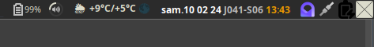
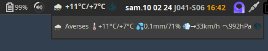
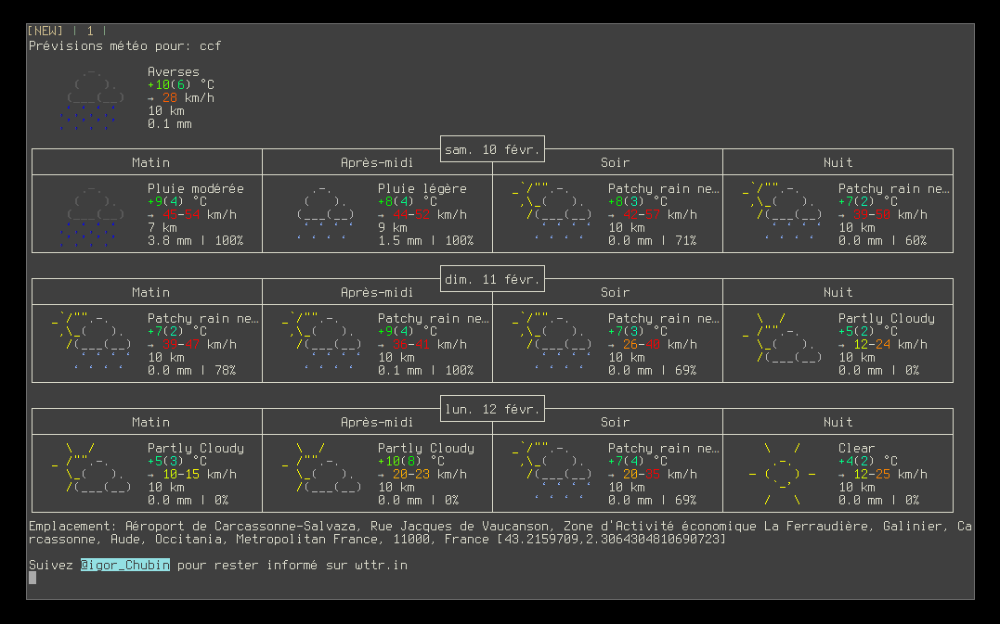

# Awesomewm Weather Widget Based on [wttr](https://github.com/chubin/wttr.in)

Inspired by [The Streetturtle Weather Widget](https://github.com/streetturtle/awesome-wm-widgets/tree/master/weather-widget), [wttr-widget](https://github.com/pivaldi/wttr-widget) use [wttr](https://github.com/chubin/wttr.in) under the hood and *does not need any API key*.  

This widget has three modes :

1. Used in the widget-bar :
   <p align="center">
       
   </p>
1. Used as a tooltip **when mouse enter hover the widget** in the widgets-bar :
   <p align="center">
       
   </p>
1. Used in a terminal popup to fetch the forecasts **clicking on the widgets** :
   <p align="center">
       
   </p>

## Customization

It is possible to customize the widget by providing a table with all or
some of the following config parameters :

| Name | Default | Description |
|------|---------|-------------|
| location | "Oymyakon" | See [the supported location types](https://wttr.in/:help) |
| timeout | 120 | Refresh timeout |
| format | "%c%t/%f+%m" | The online output used in the widget-bar. See [the One-line output](https://github.com/chubin/wttr.in?tab=readme-ov-file#one-line-output) |
| format_tooltip | "%c%C+🌡️%t/%f+💦%p/%h+💨%w+〽%P+%m" | The online output used in the tooltip. |
| font | `beautiful.font:gsub("%s%d+$", "") .. " 9"` | The font to use in the widget bar/tooltip |
| units | "m" | See [the supported units](https://wttr.in/:help) |
| lang | "ru" | See [the supported languages](https://wttr.in/:help) |
| terminal | "urxvt" | The terminal used to see the forecasts |

### Examples:

```lua
local weather_widget = require("wttr-widget.weather")
local wttr = weather_widget({
            location = "ccf",
            lang = "fr",
}),
```

## Installation

1. Clone this repo under **~/.config/awesome/**:

    ```bash
    git clone git@github.com:pivaldi/wttr-widget.git ~/.config/awesome/wttr-widget
    ```

1. Require weather widget at the beginning of **rc.lua**:

    ```lua
    local weather_widget = require("wttr-widget.weather")
    ```

1. Add widget to the tasklist:

    ```lua
    s.mytasklist, -- Middle widget
        { -- Right widgets
            layout = wibox.layout.fixed.horizontal,
            ...
            weather_widget({
                location = "ccf",
                lang = "fr",
            }),
            ...
    ```

## Widget placement in one screen only

In order to place a widget only in one monitor, you can use this snippet :

```lua
local my_text_font = beautiful.font:gsub("%s%d+$", "") .. " bold 9"
local weather_widget = require("wttr-widget.weather")
local wttr = weather_widget({
            location = "ccf",
            lang = "fr",
            font = my_text_font,
})

…

awful.screen.connect_for_each_screen(function(s)
…
    local weather_wdg = nil
    if s == screen.primary then
      weather_wdg = {
        layout = awful.widget.only_on_screen,
        screen = screen.primary, -- Only display on primary screen
        wttr,
      }
    end

    -- Create the wibox
    s.mywibox = awful.wibar({
        position = "top",
        screen = s,
        bg = beautiful.pi_wibar_bg,
    })

    -- Add widgets to the wibox
    s.mywibox:setup {
      layout = wibox.layout.align.horizontal,
      { -- Left widgets
        layout = wibox.layout.fixed.horizontal,
        …
      },
      s.mytasklist, -- Middle widget
      { -- Right widgets
        layout = wibox.layout.fixed.horizontal,
        …
        weather_wdg,
        …
      },
    }
end
)
```

## Key bindings

It is possible to bind key shortcut with toggling tooltip or opening terminal forecast :

```lua
  awful.key({"Mod4",}, "m", wttr.toggle_tooltip,
    {description="show wttr weather tooltip", group="awesome"}),
  awful.key({"Mod4", "Shift"}, "m", wttr.show_forecast,
    {description="show wttr weather forecast", group="awesome"}),
```
